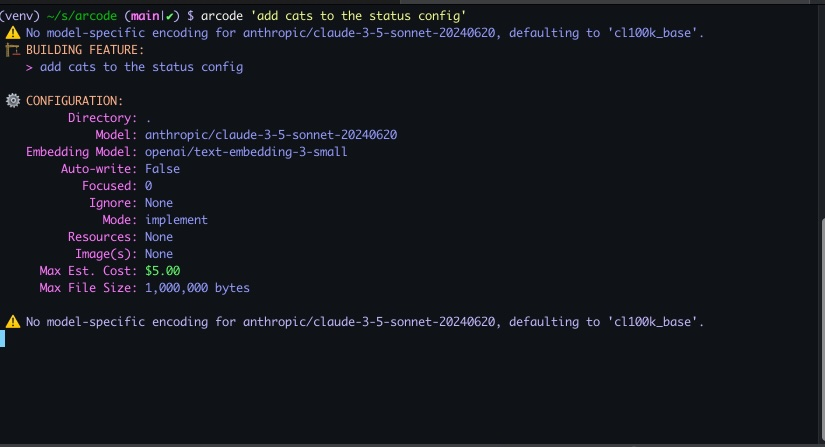

# codey
AI coding agent


## Description

Codey is a command-line tool designed to facilitate holistic software development via LLM. It allows users generate feature implementations for a given codebase based on user-defined requirements.

## Demo


### Provide your requirements:


### Review and approve changes:


## Features

- Output modified files and a summary of changes required to implement the requested features.

## Installation

1. Clone the repository:
    ```bash
    git clone https://github.com/alexdredmon/codey
    cd codey
    ```

2. Install the required dependencies:
    ```bash
    pip install -r requirements.txt
    ```

3. Set up your OpenAI API key:
    ```bash
    export OPENAI_API_KEY=<your_openai_api_key>
    ```

## Usage

Run Codey with the following command:
```bash
python main.py --dir <codebase_directory> <requirements>
```

## Parameters:
```bash
--dir <codebase_directory>: Specify the working directory of the codebase (defaults to the current directory if not specified).
<requirements>: List the requirements or features to be built on the codebase.
````

## Examples:
Generate a feature plan based on the specified requirements:
```bash
python autodev.py --dir . "Implement authentication" "Add logging"
````

Use the tool with input from a file:
```bash
cat feature_requirements.txt | python main.py --dir ./my_codebase
````

## Configuration
Ensure `OPENAI_API_KEY` is set as an environment variable and/or update the default value for `API_KEY` in `config.py`.

## License
This project is licensed under the MIT License. See the LICENSE file for more details.

## Contributing
Contributions are welcome! Please fork the repository and submit a pull request with your changes.
